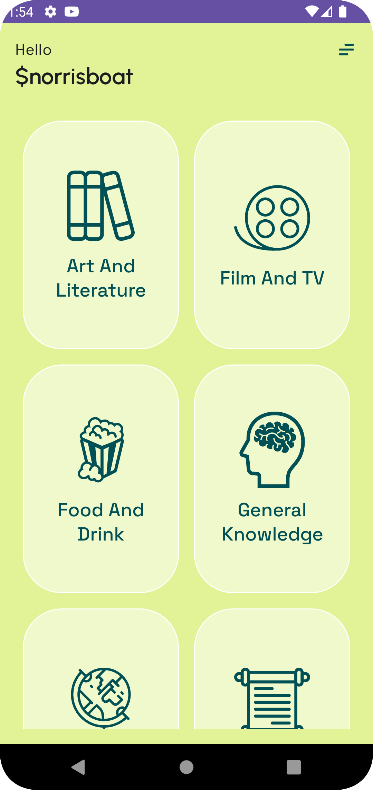
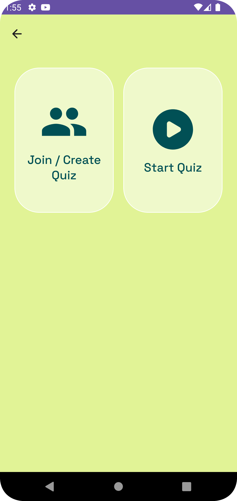
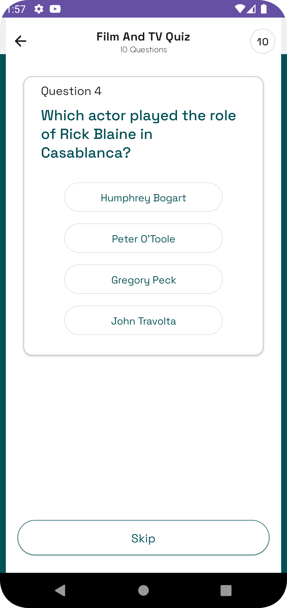
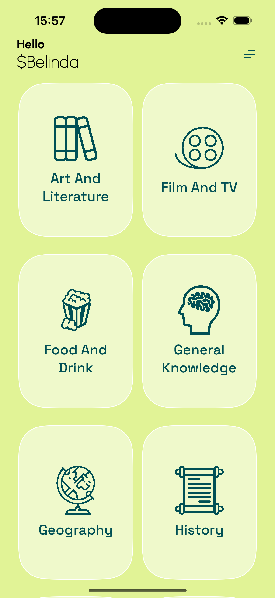
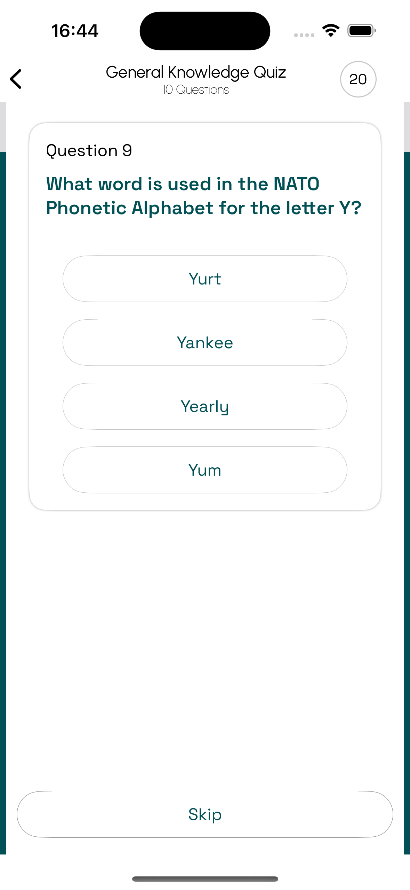
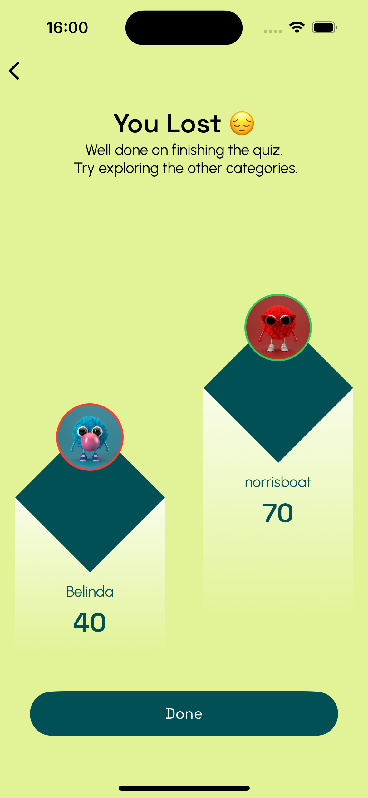

# Ziuq

Yes, Ziuq is Quiz spelled backward 😀. This is a quiz app built using [Kotlin Multiplatform](https://kotlinlang.org/docs/multiplatform.html) that runs on both Android and iOS platforms. It's a sample project to show the power of KMP. This project shares everything except UI. It runs with the [server side project](https://github.com/norrisboat/ZiuqServer) also written in Kotlin with [Ktor](https://ktor.io).

Design inspiration by [MindInventory](https://dribbble.com/shots/20511315-Educational-Quiz-App)

## Platforms

## 📦 Screenshots
### Live Quiz Demo

### Android
  

### iOS
    

## ⚙️ Architecture
The app is shared between Android and iOS. The shared code is written in Kotlin and the UI is built with Compose for Android and SwiftUI for iOS. The shared module is mainly built with clean architecture.

### Modules
- shared:
    - contains all the shared code between the platforms including View Models, networking, WebSockets, Strings and Image Resources
- android:
    - contains the android app
- ios:
    - contains the ios app

## 📱Features

* User authentication
* Solo Quiz
* Live Quiz with answers tracking

## 💾 Installation

1. Clone the repository.
2. Open the project in Android Studio.
3. Replace LOCALHOST(Extensions.kt) with server URL.
4. Build and run the app on an Android device or emulator.
5. Open the project in Xcode.
6. Build and run the app on an iOS device or simulator.

## ❤️ Built with
- [Kotlin Multiplatform](https://kotlinlang.org/docs/multiplatform.html) - The Kotlin Multiplatform technology is designed to simplify the development of cross-platform projects.
- [SQLDelight](https://github.com/cashapp/sqldelight) - SQLDelight is an open-source library developed by Cash App (formerly Square, Inc.) for working with SQL databases in Kotlin-based Android and multi-platform applications.
- [Multiplatform Settings](https://github.com/russhwolf/multiplatform-settings) - A Kotlin Multiplatform library for saving simple key-value data.
- [Koin](https://insert-koin.io/) - The pragmatic Kotlin & Kotlin Multiplatform Dependency Injection framework.
- [Kotlinx-datetime](https://github.com/Kotlin/kotlinx-datetime) - KotlinX multiplatform date/time library.
- [Kotlinx-serilization](https://github.com/Kotlin/kotlinx.serialization) - Kotlin multiplatform / multi-format serialization.
- [KMM-ViewModel](https://github.com/rickclephas/KMM-ViewModel) - Library to share Kotlin ViewModels with SwiftUI
- [Moko Resources](https://github.com/icerockdev/moko-resources) - Resources access for mobile (android & ios) Kotlin Multiplatform development

## 🙋🏻‍♂️ Say Hi

## 📜 License

This project is licensed under the [MIT License](https://www.droidcon.com/2023/09/06/migrating-an-android-app-to-ios-with-kmp-part-i-first-steps-and-architecture/).